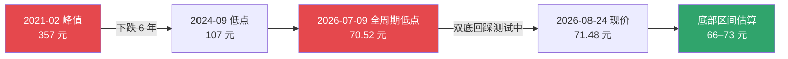
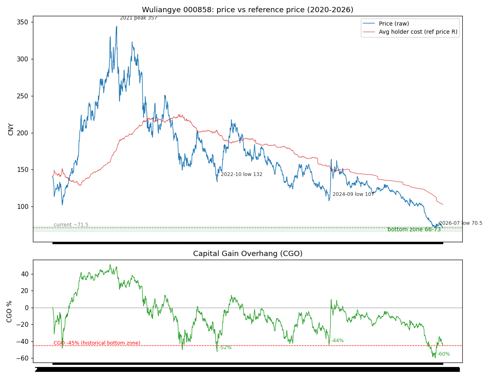
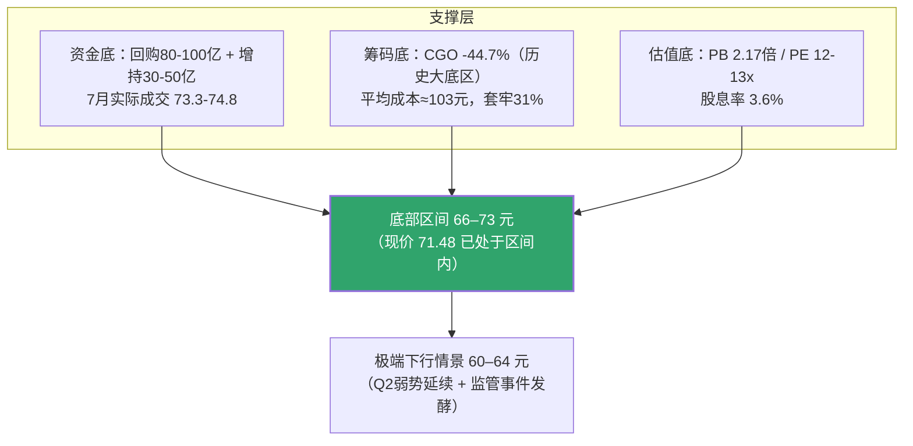

# 五粮液（000858.SZ）投资分析报告

> **数据截至**：2026-08-24 ｜ **现价**：71.48 元 ｜ **市值**：约 2,775 亿元
> 报告框架：**回购资金流 × CGO 筹码结构** 双指标测算底部，辅以财务/估值/风险验证

---

## 一、报告概要（核心结论）

| 维度 | 结论 |
|---|---|
| **底部区间** | **66–73 元**（主区间，现价已处于其中）；极端下行情景 **60–64 元** |
| **底部时间** | **2026年9月–12月** 概率最大；近期催化：8月底半年报、11月7日集团增持截止 |
| **底部确认信号** | 放量站上 **78.5 元**（7-30 反弹高点）→ 双底成立；跌破 **70.5 元**（2020年以来全周期最低）→ 下移看 66–68 元 |
| **核心多头支撑** | ① 回购 80–100 亿（至 2027-05）② 集团增持 30–50 亿（至 2026-11）③ CGO -45% 历史大底区 ④ PB 2.17 倍历史最低 |
| **核心风险** | 2025 年报重述/造假争议、董事长被查、2026Q2 单季利润骤降、批价创新低 |

**一句话结论**：五粮液正处于**业绩变脸后的基本面重估期**，股价 71.48 元位于 2020 年以来全周期最低点附近，回购+增持合计 110–150 亿真金白银构成硬支撑，CGO 深度超卖 + 估值历史低位叠加，**底部大概率在未来 1–4 个月内（2026 年 9–12 月）于 66–73 元区间确认**。

---

## 二、股价现状与历史位置

| 指标 | 数值 | 说明 |
|---|---|---|
| 现价（2026-08-24） | **71.48 元** | 距全周期低点 70.52 仅 1.4% |
| 全周期最低（2026-07-09） | 70.52 元 | 2020 年以来最低（52 周低 67.94 为前复权口径） |
| 52 周高点 | 126.69 元 | 较高点回撤约 44% |
| 2021 峰值（2021-02） | 357 元 | 累计回撤约 80% |
| 2026-07-09 反弹高点（7-30） | 78.56 元 | 随后回落至 71.19，双底回踩形态 |

**图表**（价格 vs 平均持仓成本 + CGO 全周期走势）：

---

## 三、财务基本面：业绩大变脸与"重述"事件

### 3.1 关键财务数据

| 报告期 | 营业收入 | 同比 | 归母净利润 | 同比 | 备注 |
|---|---|---|---|---|---|
| 2024 年报 | 891.7 亿 | — | **318.5 亿** | +5.4% | 10派31.69 |
| 2025 一季报（重述前） | 369.4 亿 | — | 148.6 亿 | — | 已重述 |
| **2025 一季报（重述后）** | **170.9 亿** | — | **44.2 亿** | — | 调减 198.6 亿 |
| 2025 前三季（重述后） | 306.4 亿 | — | 64.7 亿 | — | 累计调减营收 303 亿 |
| **2025 年报** | **405.3 亿** | **-54.5%** | **89.5 亿** | **-71.9%** | 10派25.78，派息率超 100% |
| **2026 一季报** | **228.4 亿** | **+33.7%** | **80.6 亿** | **+82.6%** | 低基数下的高增长 |
| 2026 半年报预告 | — | — | **87.3–92 亿** | +88.8%~99.0% | 隐含 Q2 单季仅约 7–11 亿 |

### 3.2 "重述"事件要点（重大不确定性）

- 公司以"收入确认核算差错更正"为由，将 **2025 年一季度/半年度/三季度** 报表大额调减：前三季度营收合计调减约 **303 亿**、归母净利调减约 **150 亿**
- 调减对应负债端"其他流动负债"暴增（2025 三季度末达 278 亿）——即**大量"已收款未发货"订单被重新归类为负债**，收入确认节点后移（发货确认 → 终端动销确认）
- 争议：调整幅度异常（营收腰斩）、定性存疑（会计政策变更包装为差错更正）、时点敏感（**董事长被查、董事会换届**）——市场存在造假/索赔/ST 担忧
- 深层疑问：**2024 年收入是否存在同样偏松的确认**？若 2024 年报亦被重述，估值锚将再次下移（此为最大的尾部风险）

### 3.3 经营基本面

- **Q1 2026 逆袭的成色**：营收 +33.7%、净利 +82.6% 建立在重述后的低基数上；**Q2 单季净利骤降至约 7–11 亿**，显示复苏远未确立，收入确认后移使单季数据失真，需看全年与合同负债
- **行业层面**：白酒深度去库存、八代五粮液批价月跌超 5% 创新低、经销商"价格倒挂"抛货；已有批价回涨、茅台提价的边际改善信号，但未确认

---

## 四、回购 × 增持：真金白银的硬支撑

| 项目 | 计划 | 进度（截至 2026-07-31 / 08-07） | 关键价格 |
|---|---|---|---|
| **回购（减资注销）** | **80–100 亿元**，价格上限 151.01 元/股，期限至 **2027-05-17** | 累计回购 1,331.7 万股（0.34%），投入 **10.02 亿元**；7 月单月 8.02 亿 | 7 月成交区间 **73.34–74.84 元**（均价≈74.4） |
| **集团增持** | **30–50 亿元**，不设价格区间，期限至 **2026-11-07**，锁定 6 个月 | 已增持 1.99 亿元（均价≈82.7 元，现浮亏约 13%） | 尚有 **28–48 亿** 弹药未用 |

**要点解读**：

1. **现价已低于公司自身买入成本**：公司 7 月以 73.3–74.8 元买了 8 亿，现价 71.48 元在其成本下方，且回购无最低价限制、按月披露、月均 8–10 亿稳定执行，理论上**越跌越买**
2. **集团增持被套会加大低位买入动力**：均价 82.7 元浮亏约 13%，叠加"6 个月锁定+承诺不减持"，11 月 7 日前是明确的时间窗口
3. **合计买盘规模**：110–150 亿元 ≈ 当前流通市值的 **4–5.4%**，构成"政策底/资金底"

---

## 五、CGO 指标分析：筹码已深度套牢

**CGO（Capital Gain Overhang，资本利得悬置）**：衡量现价相对投资者平均持仓成本的位置，负值越大说明套牢越深，亏损厌恶导致抛压衰竭，历史上接近极端负值即接近筹码出清区。

**计算方法**（Grinblatt-Han 框架）：以换手率加权递归计算持仓参考价 R（k = 1/(252×年均换手)），CGO = (P − R) / P。

### 5.1 当前状态与历史校准

| 时点 | 价格（不复权） | 平均持仓成本 R | CGO | 说明 |
|---|---|---|---|---|
| 2021-02 峰值 | 344–357 | 178 | **+48%** | 高位，浮盈巨大 |
| 2022-10 低点 | 132 | 203 | **-52%** | 历史级超卖 |
| 2024-02 低点 | 123 | 176 | **-39%** | 底部区 |
| 2024-09 低点 | 107 | 155 | **-44%** | 底部区 |
| **2026-07-09 低点** | **70.5** | 113 | **-60%** | **6 年多最深，创纪录** |
| **当前（08-24）** | **71.5** | **≈103** | **-44.7%** | 历史大底区间中部 |

### 5.2 结论

- 当前持仓平均成本约 **103 元**，现价低于成本约 **31%**——绝大多数持仓者深套
- 历史大底的 CGO 区间为 **-39% ~ -52%**，当前 **-44.7%** 已在区间内；7-09 的 -60% 说明本轮周期超卖可以更深
- 若价格再测 70.5 一线，CGO 将回落至 **-47% ~ -50%**（2022-10 / 2024-09 级别）；跌破 70.5 创新低则逼近 -55% 以下，进入极值区

---

## 六、估值分析

| 指标 | 数值 | 历史对照 | 底部对应 |
|---|---|---|---|
| **PB** | **2.17 倍**（2026Q1 每股净资产 32.98 元） | 2024-09 底部为 3.05 倍，**当前为历史最低区间** | 2.0–2.2 倍 → **66–72 元** |
| **股息率** | 2025 年度 2.578 元/股 → **3.6%** | 派息率超 100%（动用现金） | 若 2026 盈利恢复，股息率升至 4%+ 有吸引力 |
| **PE（2026E）** | 若全年净利 185–215 亿（EPS 4.8–5.5）→ **13–15 倍** | 2024 年低点 PE(TTM) 约 13 倍 | 12–13 倍 × EPS 5.4 → **65–72 元** |

**估值要点**：PB 与 PE 两个独立锚在 **66–72 元** 区间重合，与 CGO 底部区、回购承接区（73–75 上方）共同收敛于当前价位附近。

---

## 七、底部测算：三重支撑叠加

| 情景 | 区间 | 触发条件 |
|---|---|---|
| **主区间** | **66–73 元** | 双底回踩 70.5–72 不破；回购/增持持续承接 |
| **极端下行** | **60–64 元** | Q3/Q4 业绩继续恶化（2026E 净利 <160 亿）；监管认定造假→索赔/ST 发酵；批价继续崩 |
| **上行突破** | 站上 78.5 元 | 放量突破 7-30 反弹高点 → 双底成立，上看 82–85（增持均价附近） |

---

## 八、时间判断：底部什么时候出现

**核心窗口：2026 年 9 月 – 12 月（未来 1–4 个月）**

| 时间 | 事件 | 对底部的影响 |
|---|---|---|
| **2026-08-31 前** | 2026 半年报披露 | 若合同负债维持高位（"收入后移"而非需求崩塌）→ 情绪修复催化；若 Q2 恶化超预期 → 先下探 |
| 2026 年 9–10 月 | 中秋+国庆备货旺季 | 批价/动销验证（已有"批价回涨、茅台提价"边际信号） |
| **2026-11-07 前** | 集团增持截止 | 28–48 亿弹药大概率在低位加速买入，**最明确的托底时间窗** |
| 2026-10 月底 | Q3 财报 | 验证收入后移逻辑与全年指引 |
| 至 2027-05-17 | 回购持续执行 | 价格低于 75 元则月均 8–10 亿承接，全年不断档 |

**历史规律参考**：本轮下跌的大底均出现在**业绩披露/旺季前夕**（2022-10、2024-02 春节后、2024-09 中秋前、2026-07 半年报预告后）。2026-07-09 已出现 -60% CGO 的极端低点，若 8 月底–9 月回踩 70–72 不破，**双底确认，底部 = 2026 年 Q3 末–Q4**。

---

## 九、风险提示

1. **财务真实性风险（最大尾部风险）**：2025 年报表重述引发造假/虚假陈述质疑，投资者已可发起索赔（2025-04-28 至 2026-05-01 买入者）；若 2024 年报也被重述、监管介入认定违规，股价存在二次冲击
2. **治理风险**：董事长被查、董事会换届、董秘/董事辞职密集，治理不确定性高
3. **基本面风险**：2026Q2 单季净利骤降（约 7–11 亿），复苏未确立；白酒行业去库存、价格倒挂持续
4. **技术面风险**：若放量跌破 70.5 元创新低，下方无历史支撑参考，底部区间整体下移
5. **市场风险**：回购/增持执行不及预期、市场系统性下跌

---

## 十、数据来源与免责声明

**主要数据来源**：
- 五粮液公告（回购方案/进展 2026-08-04、增持进展 2026-08-07、2025 年报、2026 一季报、2026 半年度业绩预告）
- 中新经纬《五问五粮液：为何业绩大变脸？》（重述事件分析）
- 腾讯行情接口 / 东方财富数据中心（行情与财务指标）
- CGO 指标为本报告基于 2020-01 至 2026-08 日线数据独立测算（前复权，Grinblatt-Han 框架）

> **免责声明**：本报告仅为基于公开数据的量化研究，不构成任何投资建议。五粮液当前存在重大会计争议、治理变动与经营不确定性，任何底部测算都包含显著误差风险，投资有风险，入市需谨慎。

---

*报告生成时间：2026-08-24 ｜ 数据文件：`wly_bottom_analysis.png`（底部分析图）、`/tmp/cgo_full.csv`（CGO 全周期序列）*
